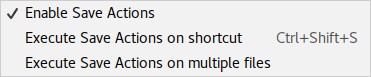

# Save Actions Plugin

[](https://plugins.jetbrains.com/plugin/7642-save-actions)
[](https://travis-ci.org/dubreuia/intellij-plugin-save-actions)
[](https://ci.appveyor.com/project/dubreuia/intellij-plugin-save-actions)
[](https://codecov.io/gh/dubreuia/intellij-plugin-save-actions)
[](https://codeclimate.com/github/dubreuia/intellij-plugin-save-actions)

Supports configurable, Eclipse like, save actions, including "optimize imports", "reformat code", "rearrange code", "compile file" and some quick fixes like "add / remove 'this' qualifier", etc. The plugin executes the configured actions when the file is synchronised (or saved) on disk.

Using the save actions plugin makes your code cleaner and more uniform across your code base by enforcing your code style and code rules every time you save. The settings file (see [files location](#files-location)) can be shared in your development team so that every developer has the same configuration.

The code style applied by the save actions plugin is the one configured your settings at "File > Settings > Editor > Code Style". For some languages, custom formatter may also be triggered by the save actions plugin. For example for Dart developers, enable "Use the dartfmt tool when formatting the whole file" option in "File > Settings > Editor > Code Style > Dart > Dartfmt".

## Content

- [Features](#features)
- [Compatibility](#compatibility)
- [Installation](#installation)
- [Configuration](#configuration)
- [Actions](#actions)
- [Eclipse support](#eclipse-support)
- [Files location](#files-location)
- [Contributing](#contributing)
- [Jetbrains plugin page](#jetbrains-plugin-page)
- [Issues](#issues)
- [Licence](#licence)

## Features

### All Jetbrains products

- Optimize imports
- Run on file save or shortcut (or both)
- Run on multiple files by choosing a scope
- Reformat code (whole file or only changed text)
- Rearrange code (reorder methods, fields, etc.)
- Include / exclude files with regex support
- Works any file type (Java, Python, XML, etc.)
- Uses a settings file per project you can commit (see [Files location](#files-location))
- Available keymaps and actions for activation (see [Keymap and actions](#keymap-and-actions))


### Java IDE products

Works in JetBrains IDE with Java support, like Intellij IDEA and AndroidStudio.

- Eclipse configuration file `.epf` support (see [Eclipse support](#eclipse-support))
- Automatically fix Java inspections (see [Java quick fixes](#java-fixes))


## Compatibility

Built with IntelliJ IDEA IC-2016.3, JDK 1.8, those are the currently supported products, and is not expected to work in other products:

-  Intellij IDEA (ultimate and community)
-  PyCharm (professional and community)
-  PHPStorm
-  AndroidStudio
-  WebStorm
-  RubyMine
-  CLion

See issue [#18](https://github.com/dubreuia/intellij-plugin-save-actions/issues/18) for a beta packaging that you can try in other products.

## Installation

### IDE (recommended)

Install it from your IDE (Intellij IDEA, PyCharm, etc.):

- "File > Settings > Plugins > Browse repositories... > Search 'Save Actions' > Category 'Code tools'"

### Jetbrains plugin repository

All versions of the plugin are available from the [Jetbrains plugin repository](https://plugins.jetbrains.com/plugin/7642). You can download the jar and add it to your IDE (you won't get updates thought):

- "File > Settings > Plugins > Install plugin from disk..."

## Configuration

The configurations are located in "File > Settings > Other Settings > Save Actions".

### Activation

You can quickly toggle the plugin activation by using the "Enable Save Action" action. Use "CTRL + SHIFT + A" then search for it. It will also show if it is currently activated or not.

| Name                               | Description
| ---                                | ---
| Activate save actions on file save | Enable / disable the plugin on file save. Before saving each file, it will perform the configured actions below
| Activate save actions on shortcut  | Enable / disable the plugin on shortcut, by default "CTRL + SHIFT + S" (configured in "File > Keymaps > Main menu > Code > Save Actions")
| No action if compile errors        | Enable / disable no action if there are compile errors. Applied to each file individually

### Global

| Name                               | Description
| ---                                | ---
| Optimize imports                   | Enable / disable import organization (configured in "File > Settings > Code Style > Java > Imports")
| Reformat file                      | Enable / disable formatting (configured in "File > Settings > Code Style"). See "Reformat only changed code" for more options
| Reformat only changed lines        | Enable / disable formatting for only changed lines, which will work only if a VCS is configured
| Rearrange fields and methods       | Enable / disable re-ordering of fields and methods (configured in "File > Settings > Code Style > Java > Arrangement")

### Build

| Name                               | Description
| ---                                | ---
| Compile file                       | Enable / disable compiling of the modified file. The compiler might compile other files as well

### File

| Name                               | Description
| ---                                | ---
| File path inclusions               | Add / remove file path inclusions (by default, everything included). The Java regular expressions match the whole file name from the project root. Include only Java files: `.*\.java`. 
| File path exclusions               | Add / remove file path exclusions to ignore files (overrides inclusions). The Java regular expressions match the whole file name from the project root. Exclude 'Main.java' only in root folder: `Main\.java`. Exclude file 'Foo.java' only in folder 'src': `src/Foo\.java`. Exclude all xml files in any folder: `.*/.*\.xml`
| Use external Eclipse configuration | Add external configuration file ".epf" to read settings from. This will update the current settings and use only the ".epf" file content. Use "reset" button to remove

### Java fixes

If a quick fix adds something that is removed by another quick fix, the removal wins.

| Name                                                                     | Description
| ---                                                                      | ---
| Add final modifier to field                                              | The field `private int field = 0` becomes `private final int field = 0`
| Add final modifier to local variable or parameter                        | The local variable `int variable = 0` becomes `final int variable = 0`
| Add static modifier to methods                                           | The method `private void method()` becomes `private static void method()` if the content does not references instance fields
| Add this to field access                                                 | The access to instance field `field = 0` becomes `this.field = 0`
| Add this to method access                                                | The access to instance method `method()` becomes `this.method()`
| Add class qualifier to static member access                              | The access to class field `FIELD = 0` becomes `Class.FIELD` for a class named Class
| Add class qualifier to static member access outside declaring class only | The access to class field `FIELD = 0` becomes `Class.FIELD` for a class named class, but only if the static member is outside declaring class
| Add missing @Override annotations                                        | The method `void method()` becomes `@Override void method()` if it overrides a method from the parent class
| Add blocks to if/while/for statements                                    | The statement `if (true) return false` becomes `if (true) { return false; }` (a block), also working for `for` and `while` statements
| Add missing serialVersionUID field for Serializable classes              | The class `class Class implements Serializable` will get a new field `private static final long serialVersionUID` with generated serial version uid
| Remove unnecessary this to field and method                              | The access to instance field `this.field = 0` becomes `field = 0`, also working for methods
| Remove final from private method                                         | The method `private final void method()` becomes `private void method()`
| Remove unnecessary final to local variable or parameter                  | The local variable `int final variable = 0` becomes `int variable = 0`
| Remove explicit generic type for diamond                                 | The list creation `List<String> list = new ArrayList<String>()` becomes `List<String> list = new ArrayList<>()`
| Remove unused suppress warning annotation                                | The annotation `@SuppressWarning` will be removed if it is unused (warning: "unchecked" doesn't work properly see [#87](https://github.com/dubreuia/intellij-plugin-save-actions/issues/87))
| Remove unnecessary semicolon                                             | The statement `int variable = 0;;` becomes `int variable = 0;`
| Change visibility of field or method to lower access                     | The field `public int field = 0` becomes `private int field = 0` if it is not used outside class, also working for methods

## Actions

Save actions are grouped under the menu "Code > Save Actions". Remember that any action is available in the action menu "CTRL + SHIFT + A". You can associate a keymap to any action in "Settings > Keymap > Search 'save actions'".

- **Enable Save Actions (default: not binded)** will activate or deactivate the plugin by changing the configuration
- **Execute Save Actions on shortcut (default: "CTRL + SHIFT + S")** will trigger the plugin manually, only if the configuration allows shortcuts (see [activation](#activation) section, the "Activate save actions on shortcut" needs to be enabled)
- **Execute Save Actions on multiple files (default: not binded)** will show a popup to select the files (or a scope) on which to trigger the plugin

<p align="center">
  
</p>

## Eclipse support

The save-actions plugin supports Eclipse configuration `.epf` files (Java IDE only). You can specify a path to an Eclipse configuration file in the "Eclipse support" settings section to import it. The plugin will load the content of the file in the plugin configuration, and disable the plugin configuration options (the checkbox will be grayed out). Use the "reset" button to remove the import.

The plugin will stay in sync with your Eclipse configuration file. Not every features are present on either side, but the ones that are in common are supported.

You can find an example of [an Eclipse configuration `.epf` file](src/test/resources/com/dubreuia/model) in the test resources.

```properties
# @title Save Actions
# @description Save Actions
# @task_type LASTMOD
file_export_version=3.0
/instance/org.eclipse.jdt.ui/editor_save_participant_org.eclipse.jdt.ui.postsavelistener.cleanup=true
/instance/org.eclipse.jdt.ui/sp_cleanup.format_source_code=true
/instance/org.eclipse.jdt.ui/sp_cleanup.format_source_code_changes_only=false
/instance/org.eclipse.jdt.ui/sp_cleanup.organize_imports=true
/instance/org.eclipse.jdt.ui/sp_cleanup.remove_trailing_whitespaces=true
...
```

## Files location

- **idea.log**: The log file the save actions plugin writes in. It contains debug information, prefixed with `com.dubreuia.SaveActionManager`. If you are using default locations, it would be in `~/.IntelliJIdeaVERSION/system/log/idea.log`.
- **saveactions_settings.xml**: The settings file is saved by project in the `.idea` folder. That file can be committed in git thus shared in your development team. If you are using the default locations, it would be in `~/IdeaProjects/PROJECT_NAME/.idea/saveactions_settings.xml`

## Contributors

Big thanks to all the contributors submitting issues, testing, and especially submitting pull requests.

See [contributors graph](https://github.com/dubreuia/intellij-plugin-save-actions/graphs/contributors) :hearts:

## Contributing

### Development environment

The plugin is built with gradle, but you don't need to install it if you build with the Intellij gradle plugin (check out the [prerequisites](https://www.jetbrains.org/intellij/sdk/docs/tutorials/build_system/prerequisites.html)). If you don't intend to use the Intellij gradle plugin, you can use native gradle (replace `./gradlew` by `gradle`).

Start idea and import the `build.gradle` file with "File > Open". Then in the "Import Project from Gradle" window, make sure you check "Use gradle 'wrapper' task configuration" before clicking "Finish". You now have a gradle wrapper installed (`gradlew`) that you can use on the command line to generate idea folders:

```bash
# Initialize idea folders
./gradlew cleanIdea idea
```

Intellij should refresh and the project is now configured as a gradle project. You can find Intellij gradle tasks in "Gradle > Gradle projects > intellij-plugin-save-actions > Tasks > intellij". To run the plugin, use the `runIde` task:

```bash
# Run the plugin (starts new idea)
./gradlew runIde
```

### Code style

The code style is located in `config/code-style.xml`, you can import it by doing "File > Settings > Editor > Code Style > Scheme > (wheel) > Import scheme > Intellij IDEA code style XML". General style should resemble existing code.

### Sending a pull request

To contribute, submit a PR without modifying the plugin version. Before sending, think about documenting your feature, code style, unit tests (if possible), integration tests (see `com.dubreuia.integration.IntegrationTest`) and proper manual testing.

## Jetbrains plugin page

The plugin is in the [JetBrains plugin repository](https://plugins.jetbrains.com/plugin/7642-save-actions), please take the time to [rate it](https://plugins.jetbrains.com/plugin/7642-save-actions)! 

## Issues

The plugin does not work? You want more features? You can [ask me on twitter](https://twitter.com/dubreuia) or [create an issue on github](https://github.com/dubreuia/intellij-plugin-save-actions/issues).

## Licence

[MIT License](LICENSE.txt)

